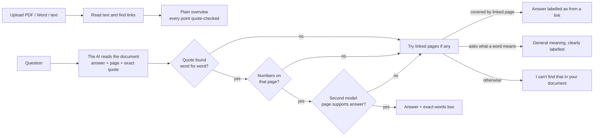

# ComVoice

**Upload a legal document. Get it explained in plain words, by voice or text. Ask questions and every answer shows the exact words it came from. If it isn't in your document, the bot says so instead of guessing.**

Legal documents are written for lawyers. People who are most affected by them (tenants, workers, residents, people with limited English) often can't read them. ComVoice is a chatbot connected to **Google's Gemini** AI models, with a **+** button to add a document:

- **Add a document** with **+**: PDF, Word (.docx) or text, up to 15 MB. Or drag a file onto the page.
- **Get an overview in plain words**, organised by the questions a resident would ask: What is this document? Why is it needed? What is being proposed? What does it mean for residents, visitors and businesses? What are the benefits? What might change or be difficult? When will I see the result? What happens next? Plus the hard legal words explained the way *this* document uses them. Where the document says nothing on a question, the overview says **"The document doesn't say."** instead of guessing.
- **Ask anything**: type, or hold the mic and speak. Answers appear as text and are **read aloud** (you can turn that off).
- **Check every answer**: each one has a "See the exact words" box with the quote and its page.
- **Read the links inside the document**: one tap reads the documents and web pages it links to, so answers can cover the fuller picture (see below).
- **Explain simpler**: one tap re-explains an answer in shorter words.
- **Accessible**: text size, high contrast, keyboard use, reduced-motion friendly.

It explains what a document says. It is **not legal advice**, and it doesn't draft or send anything for you.

---

## Following the links in a document

Many legal documents rely on links and references. ComVoice handles them like this:

| What | How it works |
|---|---|
| **Finds links** | Clickable links in PDFs, links in Word files, and web addresses written in the text |
| **Reads them on request** | Tap "Read the linked pages" under the overview. It reads up to **10** links, **one level deep**, government sites first |
| **Answers from your document first** | Only if your document doesn't answer, it checks the linked pages, and labels the answer "From a linked page (government site)" or "(not checked)", with a link to the original |
| **Lists references without links** | If the document mentions an Act or another document but doesn't link to it, ComVoice lists it ("Other laws and documents it mentions") so you can paste a link with **+ > Add a web link** |
| **Stays safe** | https only, private or internal addresses blocked (also after redirects), size and time limits, plain text only. Only links found in *your* document can be followed |

What it **can't** do (so you're not surprised): follow links behind a login or paywall, read pages that only work with JavaScript, look inside scanned images, go deeper than one level, or follow a reference that only names an Act without a link. It tells you which links it couldn't read and why.

---

## Why you can trust an answer (the four gates)

A chatbot that sounds sure and is wrong is worse than none, especially for someone who can't check the original. So ComVoice does not rely on the model behaving. Every answer taken from a document must pass four gates, and the first three are ordinary code, not AI:

| Gate | Who checks | What it stops |
|---|---|---|
| 1. The model must give a **page and an exact quote**, or say the document doesn't cover it | The AI model (forced function call) | Vague, unsourced answers |
| 2. The quote must exist **word for word** on that page | Code (`documents.find_quote`) | Made-up or altered quotes |
| 3. Every **number** in the answer must appear on the cited page | Code (`documents.numbers_supported`) | Invented or changed figures |
| 4. A **second, independent** model call confirms the page supports the answer | A separate AI call acting as a strict fact-checker | Real quotes used to say something they don't |

If any gate fails, the person gets: *"I can't find that in your document. I only answer from what it says, so I won't guess."* The same gates check every point in the overview before it is shown, and anything that fails is dropped.



**One deliberate exception: legal words.** If someone asks what a legal word means and the document doesn't define it, ComVoice can give a short **general** meaning. It is labelled *"General meaning, not from your document"* with a caution, has no source box (because it isn't from the document), and is dropped if it contains any number or the model isn't sure. Turn it off with `ALLOW_GENERAL_TERMS=0` if you want strictly document-only answers.

**Other safety choices**

- The document and linked pages are sent as data with an instruction to ignore any instructions inside them (prompt-injection defence).
- Your file is kept **in memory for this chat only** (up to 24 hours, or until you tap "Start a new document") and is never written to disk. Its text is sent to Google's Gemini API to write answers, so only upload what you are allowed to share. **On Google's free tier, Google may use what you send to improve its products (and human reviewers may read it), so don't upload confidential documents unless billing is turned on for your key.**
- The model is instructed to write at about Grade 6, never give advice and never fill in blanks such as `[insert date]`. These are instructions, not gates. The four gates are what enforce accuracy.
- Feedback is anonymous (a rating and a reason code only). Rate limiting and security headers are on. No document or model text is ever inserted as HTML.

---

## Get a Google Gemini API key

1. Go to **https://aistudio.google.com/apikey** and sign in with a Google account.
2. Accept the terms, then click **Create API key**. The free tier needs no card in most countries (in the EEA, UK and Switzerland, Google requires billing to be turned on).
3. Copy the key.
4. Put it in a file named `.env` in the project folder, on one line, with no quotes:
   ```
   GEMINI_API_KEY=your-key-here
   ```
   (`GOOGLE_API_KEY=` works too.)
5. Check it: `python check_key.py` should say **Working**. If not, it says why (wrong key, quota used up, unknown model). `python test_model.py` prints a one-line reply from the model.

**Free tier or paid?** The free tier is fine for trying this out, but it has two catches. Google may use what you send to improve its products, so it's wrong for confidential legal documents. And it has low per-minute and per-day limits, which show up as a "going too fast" message. Turning on billing for the key in Google AI Studio (pay-as-you-go) removes both problems: Google then doesn't use your data to improve its products and the limits are far higher.

Keep the key secret. Never paste it into chats, screenshots or GitHub (`.env` is already in `.gitignore`). Menu names change from time to time, so if something looks different, Google's AI Studio pages have the current steps.

## Run it on your computer

You need Python 3.10 or newer and a Gemini API key (above).

```bash
git clone <your-repo-url> comvoice
cd comvoice
python -m venv .venv && source .venv/bin/activate      # Windows: .venv\Scripts\activate
python -m pip install -r requirements.txt
cp .env.example .env                                     # then paste your key into .env (Windows: copy)
python check_key.py                                      # optional: confirms the key works
python -m uvicorn app:app --reload
```

Open http://127.0.0.1:8000. Tap **Try a sample** to see it working (a real 44-page City of Sydney draft planning agreement is included), or upload your own.

Without a key the site loads and reads files, but can't explain or answer, and says so on the page.

**Models, cost and speed.** The default model is `gemini-flash-latest`, Google's alias for its newest Flash model: fast, cheap, and able to read very long documents (about a million tokens), which suits summarising legal documents. Each question sends the whole document. To pin a specific model, set `GEMINI_MODEL` in `.env` (see https://ai.google.dev/gemini-api/docs/models for current names, for example `gemini-3.5-flash`). You can use a cheaper model for the fact-checker with `GEMINI_VERIFY_MODEL` (for example `gemini-3.5-flash-lite`). Newer Gemini models "think" before answering, and that counts toward the output limit; if you see a message about running out of room, add `GEMINI_THINKING_LEVEL=low` (or `GEMINI_THINKING_BUDGET=0` on 2.5 models). `VERIFY_WITH_MODEL=0` skips gate 4 while developing (gates 1 to 3 always run). The overview's fact-check is done in a single request, and busy or rate-limited replies are retried automatically, to stay within the free tier's limits.

| Variable | Default | Purpose |
|---|---|---|
| `GEMINI_API_KEY` | none | Required for overviews and answers (`GOOGLE_API_KEY` also works) |
| `GEMINI_MODEL` | `gemini-flash-latest` | Model that writes answers and overviews |
| `GEMINI_VERIFY_MODEL` | same as `GEMINI_MODEL` | Model that fact-checks (gate 4) |
| `GEMINI_THINKING_LEVEL` | unset | `minimal`, `low`, `medium` or `high` (Gemini 3 models) |
| `GEMINI_THINKING_BUDGET` | unset | Thinking tokens (Gemini 2.5 models). `0` turns thinking off where allowed |
| `VERIFY_WITH_MODEL` | `1` | `0` turns gate 4 off |
| `ALLOW_GENERAL_TERMS` | `1` | `0` disables the labelled general meaning of legal words |
| `MAX_QUESTION_CHARS` | `4000` | Longest question allowed |
| `ASK_LIMIT_PER_MIN` | `60` | Questions per minute per person. `0` means no limit |
| `MAX_UPLOAD_MB` | `15` | Largest file you can upload |

**"Unlimited" chat.** The chat itself has no message cap: it keeps going as long as you like, and the chat box grows for long questions (Enter sends, Shift+Enter makes a new line). What remains are safety and cost limits you can raise in `.env`: question length, questions per minute (set `ASK_LIMIT_PER_MIN=0` to switch it off), and file size. Two limits can't be removed: the model can only read so much text at once (a very long document is cut, and the app tells you), and Google's own quota for your key.

**The AI part is not switched on?** That banner means the server couldn't find your API key. It says why: no `.env` file next to `app.py`, a file named `.env.txt` (Windows Notepad adds `.txt`), or a `.env` with no `GEMINI_API_KEY=` line. The terminal also prints a line when the app starts. Fix `.env`, then **stop the app (Ctrl+C) and start it again**, because the file is read only at startup.

## Put it online (Render)

1. Push this repo to GitHub.
2. On [render.com](https://render.com) choose **New > Blueprint** and pick the repo. It reads `render.yaml`.
3. Add `GEMINI_API_KEY` when asked. Deploy.

Any host that runs `uvicorn app:app --host 0.0.0.0 --port $PORT` works. Documents live in memory, so a restart clears them (people just upload again). Run a single instance.

## Tuning the bot's style

`data/tuning.md` is a plain text file that steers the bot's **tone and wording**. It is switched on and comes filled in with a community-communication style guide: plain everyday words instead of planning jargon, warm and balanced wording, careful about what is approved versus proposed, and clear about affordable housing.

It can't teach the bot facts or loosen the safety checks. The guide's "what does this mean to me?" idea is kept, but only for what the document itself says. If a document says nothing about traffic, schools, parking or dates, the bot says "The document doesn't say anything about that" instead of adding general knowledge, because that would be guessing and could not be backed by a quote.

To change it: edit the file, then stop the app (Ctrl+C) and start it again. To switch it off, delete everything below the top comment.

The bot does **not** learn by itself from chats. Language models don't update from conversations, and storing people's legal chats to train on would be a privacy problem. If its answers are too long, too formal or explain words badly, add two or three short examples of the style you want. Use no real names or figures from any document. (Fine-tuning a model on many chats is a separate, paid process, and it wouldn't make the bot more accurate about a new document, so it isn't recommended here.)

The **structure** of the overview (the ten questions above) is in `ai.py`, in the `SECTIONS` list and `OVERVIEW_TASK`.

## Tests

```bash
pip install -r requirements-dev.txt
python -m pytest tests -q
```

No API key or internet needed (the AI provider and web fetching are replaced by fakes):

- `test_llm.py`: the Gemini adapter. The request shape (forced function call, document in the system instruction, thinking headroom), plain-words messages for a wrong key, quota used up, unknown model and blocked replies, automatic retries, and the **real Google SDK talking to a local fake Google server** to prove the requests are formed correctly, including every tool the app uses
- `test_wire_end_to_end.py`: the whole app (upload, overview, answer, refusal) run through the real SDK against that fake server
- `test_verify.py`: exact-quote matching (line breaks, curly quotes, altered quotes, ellipsis tricks) and number checking, on the real sample PDF
- `test_extract.py`: PDF text and link annotations, Word text/tables/hyperlinks, text files, scanned and password-protected PDFs, unsupported and oversize files
- `test_links.py`: private, loopback and cloud-metadata addresses, credentials in URLs, bad ports, redirect-to-private, redirect loops, oversized pages, login walls, PDFs, official-site detection, http upgraded to https, the 10-link limit
- `test_app.py`: uploads, overview items with invented quotes dropped, good answers pass, invented quotes and numbers refused, a rejecting fact-checker respected, linked-page answers labelled and ordered after the document, the labelled legal-word path (and when it must stay silent), rate limits, missing key, private workspaces

A browser-level test (jsdom) drives the real UI against the real server:

```bash
python tests/ui/serve_fake.py &        # port 8123
cd tests/ui && npm install && npm test
```

### What has and hasn't been tested

This was built and tested **without a live API key**. Everything above passes, but the model's real wording, speed and refusals are untested, and the calls to Google were checked against stub clients and a local fake server rather than Google itself. Before relying on it:

1. Run `python check_key.py` and confirm it says **Working**.
2. Upload one of your own documents and check the overview reads well and every "See the exact words" box matches the file.
3. Ask questions the document answers, and questions it doesn't (the bot should decline).
4. Try a document with links and tap "Read the linked pages".
5. Try Chrome or Edge on a phone for the hold-to-talk mic (voice input uses the browser's speech recognition, which Firefox doesn't have).
6. The layout was checked with static renders and a DOM test, not screenshots from a live browser.

## Project layout

```
app.py              FastAPI app: upload, overview, ask, link reading, sessions, security
ai.py               The four gates, the overview, labelled legal-word meanings
llm.py              One small door to Google Gemini (forced function calls, retries, plain-words errors)
check_key.py        Checks your API key works, in plain words
test_model.py       One-line reply from the model, or a list of models your key can use
documents.py        Reading PDF / Word / text, finding links, exact-quote and number checks
links.py            Safe fetching of linked pages (SSRF protection, parallel, limits)
data/               sample.pdf (demo document), config.json, tuning.md (your style notes)
static/             index.html, style.css, app.js (no build step, no framework)
tests/              pytest suite, plus tests/ui for the browser-level test
render.yaml         One-click deploy on Render
```

## Limits and what comes next

- **One document at a time**, sent whole (up to about 300 thousand characters, roughly 75 thousand tokens). For bigger sets, add retrieval and keep gates 2 to 4 unchanged.
- **English only for now.** Voice in community languages, with a fact-check of the translation, is the natural next step because voice is what reaches people who can't read well.
- **No scanned documents yet.** Photos and scanned PDFs need OCR.
- **Links are one level deep** and limited to 10 per document. Linked pages are unofficial unless on a government domain, and are always labelled.
- **Gate 4 can be too strict.** It may refuse an answer that combines facts from several pages. That is the safe failure.
- **Voice quality depends on the browser and device.**
- **DNS rebinding.** The address is checked before the first request and each redirect, but the HTTP client looks the name up again when it connects, so a rebinding race is possible. For production, route fetches through a locked-down egress proxy.

## Data and licence

Code is MIT licensed (see `LICENSE`). `data/sample.pdf` is a City of Sydney draft planning agreement published for public exhibition; it is included only as a demo document and remains the council's. Check the council's terms before reusing it.
